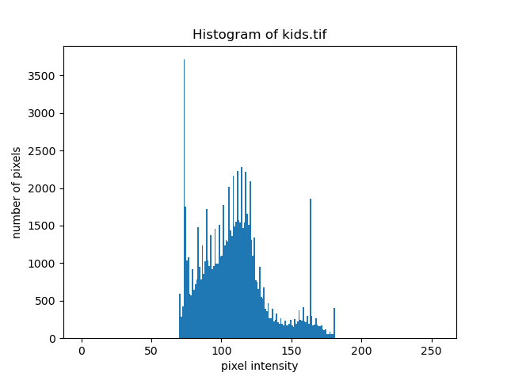

## Pointwise Operations and Gamma

### Histogram of an Image

#### Input Image kids.tif




#### Input Image race.tif


### Histogram Equalization for kids.tif

```py
def equalize(x: np.array, path: str):
    hist, bins = np.histogram(x.flatten(), bins=np.linspace(0, 255, 256))
    cdf = hist.cumsum()
    cdf_normalized = cdf * float(hist.max()) / cdf.max()
    equalized_hist = np.interp(x, bins[:-1], cdf_normalized)
    
    # Plot the normalized CDF
    plt.plot(cdf_normalized)
    plt.title('Normalized CDF')
    plt.xlabel('Pixel Intensity')
    plt.ylabel('CDF')
    plt.savefig(Path(path).stem + '_normalized_cdf.png')
    plt.close()

    # Plot the equalized histogram
    plt.hist(equalized_hist.flatten(), bins=256)
    plt.title('Equalized Histogram')
    plt.xlabel('Pixel Intensity')
    plt.ylabel('Frequency')
    plt.savefig(Path(path).stem + '_equalized_hist.png')
    plt.close()
    
    plt.imsave(Path(path).stem + '_equalized.png', x, cmap='gray')
```


### Contrast Stretching of kids.tif

```py
def stretch(input_image, T1, T2, path: str):
    # Ensure input image is of type uint8
    input_image = np.asarray(input_image, dtype=np.uint8)

    # Create an output array of the same shape as the input image
    output_image = np.zeros_like(input_image)

    # Apply the contrast stretching transformation
    output_image[input_image <= T1] = 0
    output_image[input_image >= T2] = 255
    output_image[(input_image > T1) & (input_image < T2)] = ((input_image[(input_image > T1) & (input_image < T2)] - T1) / (T2 - T1)) * 255
    
    # Plot the equalized histogram
    plt.hist(output_image.flatten(), bins=np.linspace(0, 255, 256))
    plt.title('Stretched Histogram')
    plt.xlabel('Pixel Intensity')
    plt.ylabel('Frequency')
    plt.savefig(Path(path).stem + '_stretch_hist.png')
    plt.close()
    
    plt.imsave(Path(path).stem + '_stretch.png', output_image, cmap='gray')
```


### Gamma

#### Monitor Gamma

##### Matching Gray Level = 170


##### Derivation Relating Gray Level to Gamma

The perceived intensity of the checkerboard ($I_c$), is given by:

$I_c =  (\frac{I_{255} + 0}{2})$

The percieved intensity of the gray level $g$ ($I_g$), produced by the monitor is given by:

$I_g = I_{255} (\frac{g}{255})^\gamma$

To find the value of $\gamma$ for the monitor, we need to determine the gray level $g$ which makes $I_g = I_c$.

Substituting, we have:

$\frac{I_{255} + 0}{2} = I_{255} (\frac{g}{255})^\gamma$

Solving for $\gamma$ creates a relation directly to $g$, gray level.

$(\frac{g}{255})^\gamma = \frac{1}{2}$

$\gamma = \frac{\log(\frac{1}{2})}{\log(\frac{g}{255})}$

##### Measured Gray Level and Gamma

Monitor Gamma = 1.7

Measured Gray Level = 170

#### Gamma Correction

##### Original linear.tif


##### Corrected linear.tif


##### Original gamma15.tif


##### Corrected gamma15.tif to Monitor Gamma (1.7)

Performed correction from $\gamma = 1.5$ to $\gamma = 1.7$ by:

1. Converting the image to linear scaling using the gamma of the image and the standard equation
2. Converting this linear image back to a gamma corrected version using the monitor's gamma and the inverse equation


